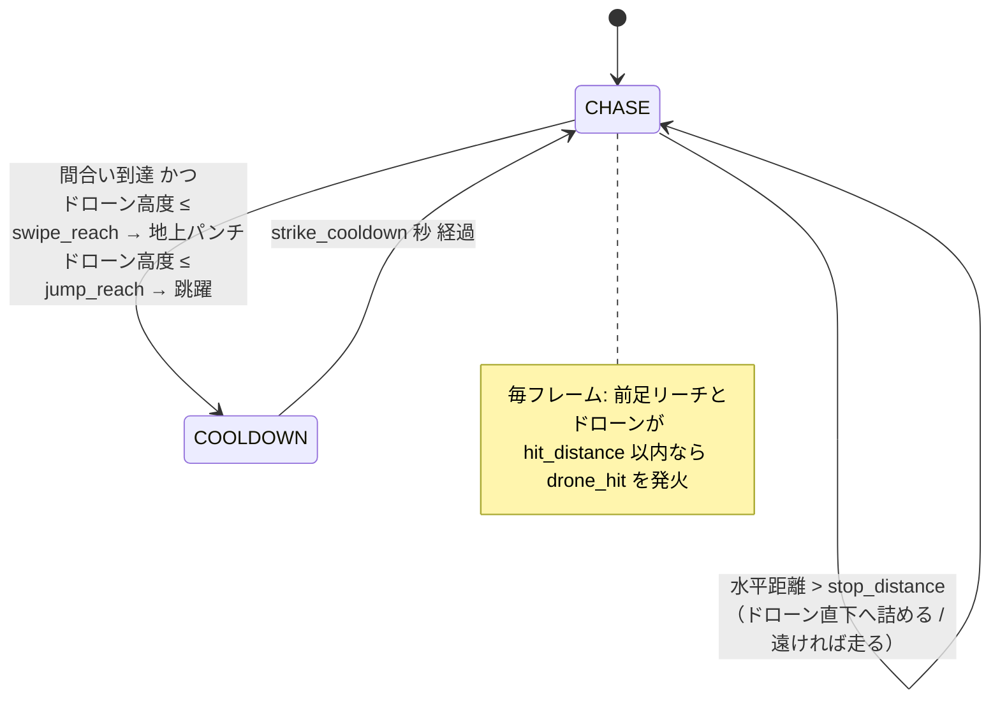

# 猫AI（ドローン追跡）調整ガイド

AI猫が箱庭ドローンを **追跡 → 間合いで跳躍/地上パンチ → 接触判定** する挙動と、その調整方法をまとめる。
すべて Godot エディタの **Inspector** で調整できる（コードを触らずに数値を変えられる）。

対象スクリプト（`res://Cat/scripts/`）:

| スクリプト | 役割 | 付くノード |
|---|---|---|
| `cat_drone_hunter.gd`（`CatDroneHunter`） | AIブレイン。猫の意図APIを叩いて追跡/攻撃 | `CatHunter`（drone_cat_1.tscn） |
| `cat_controller.gd`（`CatController`） | 猫本体。移動・アニメ・ジャンプ物理 | `Cat`（CatController.tscn のルート） |
| `drone_demo_pilot.gd`（`DroneDemoPilot`） | デモ用にドローンを自動飛行させる | `DroneDemoPilot`（drone_cat_1.tscn） |

> 設計思想：`CatController` は入力もAIも知らず、**意図API**（`move_dir` / `run_held` / `try_jump()` / `try_attack()`）だけを公開する。
> `CatDroneHunter` はプレイヤー入力(`play_test.gd`)と同じ流儀で、その意図APIを毎フレーム設定する。だからAI差し替え・手動操作が同じ口で行える。

---

## 1. AIの状態遷移

- **CHASE**：ドローンの真下へ水平に詰める。遠ければ走り、近ければ歩く（ヒステリシスあり＝下記）。
- 間合い（`stop_distance`）に入ったら足を止め、**ドローンの高度**で仕掛けを選ぶ：低い→地上パンチ、跳んで届く→ジャンプ、高すぎ→直下で待機。
- **命中判定**：猫の前足リーチ点（原点＋`head_height`、跳躍中は上がる）とドローンが `hit_distance` 以内なら `drone_hit(distance)` シグナルを発火＋ログ出力。

---

## 2. `CatHunter`（CatDroneHunter）のパラメータ

Inspector で `CatHunter` ノードを選ぶと表示される。

### 参照（結線）
| プロパティ | 既定 | 意味 |
|---|---|---|
| `cat_path` | `../Cat` | 操る猫（`CatController`）へのパス |
| `drone_path` | `../DRAvatar2` | 追跡対象（ドローン）の Node3D へのパス |

> 参照が空でも、起動時に自動でシーン内の `CatController` と `DRAvatar2` と `Hakoniwa` を探すフォールバックが働く（コンソールに `CatDroneHunter: cat=... drone=... hako=...` を出力）。cat/drone が非 null なら結線OK。

### Hakoniwa 連携グループ（STARTボタン連携）
| プロパティ | 既定 | 意味 |
|---|---|---|
| `wait_for_sim_start` | true | 箱庭の **START(Running)** まで猫を**お座り**で待たせる。false で常時稼働 |
| `hako_asset_path` | 空 | 状態参照する `Hakoniwa`(HakoAsset) ノード。空なら自動探索 |

> 挙動：START 前＝お座り → START(`HakoSimState.Running`=2)を検知 → `start_walk_time` 秒だけ**ゆっくり歩き出し** → 以降は下記の 近く歩き/遠く走り。
> 箱庭が無い環境（HuntTest 等）や状態取得不可時は「待たない」で安全側にフォールバックする。

### Tuning (m, s) グループ
| プロパティ | 既定 | 単位 | 意味 | 上げると | 下げると |
|---|---|---|---|---|---|
| `allow_run` | true | — | 追跡中に**走る**ことを許可（false=常に歩き） | — | 常に歩き |
| `start_walk_time` | 1.5 | s | START直後、この秒数だけ走らず**ゆっくり歩き出す** | 歩き出しが長い | すぐ走り出す |
| `run_distance` | 0.9 | m | この水平距離より**遠いと走り出す** | 走り出しが遠くなる＝**歩き多め** | すぐ走る |
| `run_stop_distance` | 0.55 | m | 走行中、ここまで近づくまで走り続ける（ちらつき防止のヒステリシス下限） | 近くまで走る | 早めに歩きへ |
| `stop_distance` | 0.30 | m | 水平でここまで詰めたら**足を止めて仕掛ける** | 遠めから仕掛ける | 密着してから |
| `jump_reach` | 0.75 | m | ドローン高度がこれ以下なら**跳んで**狙う | 高い相手にも跳ぶ（届かず空振りも） | 低い時だけ跳ぶ |
| `swipe_reach` | 0.34 | m | ドローン高度がこれ以下なら**地上パンチ**で狙う | 少し高くても地上攻撃 | ほぼ地面の時だけ |
| `hit_distance` | 0.35 | m | 前足リーチとドローンがこの3D距離で**命中**扱い | 当たり判定が甘くなる（当てやすい） | シビアに |
| `head_height` | 0.28 | m | 猫原点からの前足/頭リーチ高（命中の基準点） | リーチ点が高くなる | 低くなる |
| `strike_cooldown` | 1.1 | s | 一度仕掛けた後の待ち時間 | 連打しない/落ち着く | 手数が増える |

> **ヒステリシスの要点**：`run_distance`(0.9) で走り出し、`run_stop_distance`(0.55) まで走り続ける。この2段しきい値で「境界で走り↔歩きが毎フレーム切り替わってアニメがちらつく＝すり足に見える」現象を防いでいる。必ず `run_stop_distance < run_distance` にすること。

### シグナル
| シグナル | 意味 |
|---|---|
| `drone_hit(distance: float)` | 前足がドローンに届いた瞬間に発火（`distance`＝その時の3D距離）。撃墜演出やスコアの起点に使える。 |

---

## 3. `Cat`（CatController）の移動パラメータ

Inspector で `Cat` ノードを選ぶと **Locomotion** グループに表示される。「速すぎる/すり足」はここで調整する。

| プロパティ | 既定 | 単位 | 意味 | 調整の指針 |
|---|---|---|---|---|
| `walk_speed` | 0.45 | m/s | 歩行の実移動速度 | **動きが速すぎる**なら下げる |
| `run_speed` | 1.35 | m/s | 走行の実移動速度 | 走りが速すぎるなら下げる |
| `back_speed` | 0.25 | m/s | 後退の実移動速度 | — |
| `turn_speed` | 8.0 | — | 旋回の追従率（大きいほど機敏に向きを変える） | くるくる回りすぎるなら下げる |
| `blend` | 0.15 | s | アニメのクロスフェード時間 | 切替を滑らかに→上げる |
| `walk_anim_speed` | 1.0 | 倍 | **歩き**の足運び速度倍率 | **すり足なら 1.3〜1.6 に上げる** |
| `run_anim_speed` | 1.0 | 倍 | **走り**の足運び速度倍率 | 走りがすり足なら上げる |

> `walk_anim_speed` / `run_anim_speed` は足の“回転”だけを速める（実移動速度は変えない）。移動速度に対して足が遅れて滑る時に上げると接地感が出る。
> ※ Jump の蹴り出しタイミング（`JUMP_LAUNCH_T`）と着地めり込み補正テーブルは**アニメと校正済みの固定値**なので @export 化していない。ジャンプ挙動を変えたい時は相談を。

---

## 4. よくある調整レシピ

| やりたいこと | 触るノード | 操作 |
|---|---|---|
| **もっと歩かせたい（走りを減らす）** | `CatHunter` | `run_distance` を大きく（例 1.5〜2.0）。常に歩きにするなら 99 など大きな値 |
| **動きが速すぎる** | `Cat` | `walk_speed` / `run_speed` を下げる |
| **歩きがすり足に見える** | `Cat` | `walk_anim_speed` を 1.3〜1.6 に。改善しなければ `walk_speed` を下げる |
| **もっと早く跳んで攻撃してほしい** | `CatHunter` | `jump_reach` を上げる（高い相手にも跳ぶ）／`stop_distance` を上げて遠めから仕掛ける |
| **当たりにくい** | `CatHunter` | `hit_distance` を上げる（甘め）／`head_height` を対象高度に寄せる |
| **攻撃を連発させたい** | `CatHunter` | `strike_cooldown` を下げる |
| **旋回でくるくる回る** | `Cat` | `turn_speed` を下げる |

---

## 5. デモ用ドローン自動飛行（`DroneDemoPilot`）

`drone_cat_1.tscn` は本来 **箱庭コンダクタ（PDU）でドローンが飛ぶ**。コンダクタ無しで動きを見たい時のために、ドローンを自動で旋回＋上下させるデモ用ノード。

| プロパティ | 既定 | 意味 |
|---|---|---|
| `enabled` | **false**（drone_cat_1では無効） | true でデモ飛行ON。★実サーバ(PDU)で飛ばす時は false（位置が競合するため） |
| `drone_path` | `../DRAvatar2` | 動かす対象 |
| `radius` | 1.4 | 旋回半径 m |
| `ang_speed` | 0.7 | 旋回速度 rad/s |
| `height_base` / `height_amp` / `height_speed` | 0.9 / 0.6 / 0.9 | 高度 = base + amp·sin(t·speed)（既定で 0.3〜1.5m を上下） |

- **実サーバでドローンを飛ばす** → `enabled = false`（現状）。猫は実ドローンを追う。
- **コンダクタ無しでAI挙動だけ見る** → `enabled = true` に。ただし drone_cat_1 はコンダクタ起動が前提なので、単体でAIを見るなら `res://Cat/scenes/HuntTest.tscn`（ダミードローン付き・自己完結）を「現在のシーンを実行(F6)」する方が手軽。

---

## 6. 現状の制限と次段階

- `drone_hit` は**接触の検出（シグナル/ログ）まで**。実際に**ドローンを落とす（撃墜）**には、ドローンが PDU 駆動のため、既存の impulse PDU 等へ反映する連携が必要（次段階）。
- 猫のジャンプ到達は約0.5m（前足リーチ）。箱庭ドローンが高く飛ぶ場面では「直下で待つ」動きが主体になる。低空に降りた時が仕掛けどころ。
